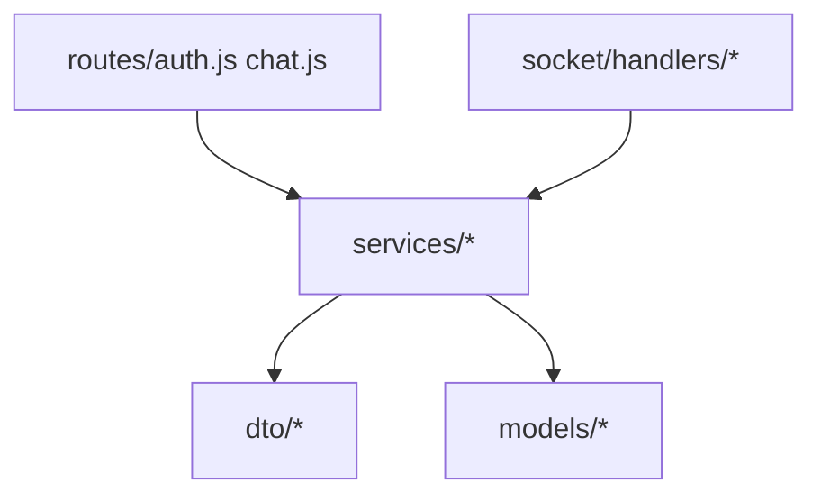

# Hush — полный справочник

Фактическое состояние репозитория. Пакеты npm: `secure-messenger-client`, `secure-messenger-backend`. Быстрый старт: [README.md](README.md).

---

## 1. Назначение

- JWT + refresh, личные чаты и каналы (`group` / `broadcast`)
- Real-time Socket.IO: текст, реакции, опросы, reply, edit, delete, forward, scheduled, self-destruct TTL
- E2E текста в браузере (RSA-OAEP + AES-GCM)
- Медиа E2E между устройствами (`local://`, без записи на диск сервера) — [docs/LOCAL_MEDIA.md](docs/LOCAL_MEDIA.md)
- WebRTC audio/video (сигналы через Socket.IO)
- Профиль, блокировка, папки, mute, оформление (фон/пузыри), session banner при 401

---

## 2. Дерево репозитория

```
Hush/
├── client/           React 18 + Vite 4
├── server/           Express + Socket.IO + Mongoose
├── docs/             ARCHITECTURE, SECURITY
├── scripts/          strip-comments.mjs, dev-tunnel (client/scripts)
├── docker-compose.yml
├── README.md
└── README2.md
```

---

## 3. Backend: слои



| Слой | Путь | Роль |
|------|------|------|
| Routes | `server/routes/` | HTTP, `auth` middleware, `next(err)` |
| Services | `server/services/` | Бизнес-логика |
| DTO | `server/dto/` | Форма ответов API |
| Socket | `server/socket/handlers/` | Realtime |
| Constants | `server/config/constants.js` | Лимиты, роли, STUN, `local://` |
| Utils | `server/utils/` | pagination, socketRoom, security |

### 3.1 Services

| Файл | Ответственность |
|------|-----------------|
| `authService.js` | register, login, refresh, profile, password, block |
| `chatService.js` | списки чатов, сообщения, поиск, link-preview, directory |
| `channelService.js` | каналы, invite, roles, pin, stats |
| `userPrefsService.js` | folders, privacy, dnd, alias, preferences, mute |
| `messageService.js` | create/emit message, scheduled, self-destruct |
| `tokenService.js` | access/refresh JWT |
| `configService.js` | ICE servers для WebRTC |

### 3.2 Socket handlers

| Файл | События |
|------|---------|
| `presence.js` | `join_user`, `join_room`, online/offline |
| `messages.js` | send/edit/delete/forward, read, reactions, vote |
| `calls.js` | `call_user`, `answer_call`, `webrtc_signal`, `end_call` |
| `mediaRelay.js` | `media_transfer_*` (ретрансляция без диска) |

---

## 4. Frontend

| Путь | Назначение |
|------|------------|
| `App.jsx` | auth, socket, layout, звонки, media receive, SessionBanner |
| `components/ChatWindow.jsx` | лента (PAGE_SIZE 30), E2E, forward, медиа |
| `components/Sidebar.jsx` | список чатов (virtualizer) |
| `components/CallInterface.jsx` | WebRTC + `webrtcCall.js` |
| `components/SettingsModal.jsx` | профиль, оформление, бэкап медиа |
| `stores/appStore.js` | token, user, keys, socket, calls, sessionExpired |
| `stores/chatWindowStore.js` | активный чат |
| `stores/sidebarStore.js` | users, channels, folders |
| `utils/crypto.js` | E2E текст |
| `utils/mediaTransfer.js` | локальные вложения |
| `utils/apiClient.js` | axios + refresh + 401 → session banner |
| `utils/appearance.js` | фон чата, цвет пузырей |
| `vite.shared.js` | proxy, HMR **выключен** на HTTPS :3443 |

**Скрипты:** `npm run dev` (3333+3443) | `dev:https` | `dev:public` | `build` | `clean:vite`

---

## 5. Порты

| Сервис | Порт |
|--------|------|
| Vite HTTP | 3333 |
| Vite HTTPS | 3443 |
| Express + Socket.IO | 5000 |
| MongoDB | 27017 |

Публичные HTTP: `GET /api/health`, `GET /api/config/webrtc`, `GET /uploads/*`.

---

## 6. REST API

Префиксы `/api/auth`, `/api/chat`. Почти всё с JWT Bearer.

### Auth

| Метод | Путь |
|-------|------|
| POST | `/register`, `/login`, `/refresh` |
| POST | `/logout`, `/update-key` |
| GET | `/me` |
| PUT | `/profile`, `/password` |
| POST | `/block` |
| GET | `/blacklist`, `/user/:id` |

### Chat

| Метод | Путь | Примечание |
|-------|------|------------|
| POST | `/upload` | **410** — отключено |
| GET | `/users`, `/channels` | + unread, lastMessage |
| POST | `/channels` | создать |
| GET | `/messages/private/:id` | `limit`, `before` |
| GET | `/messages/channel/:id` | member only |
| GET | `/messages/search` | regex по content |
| GET | `/search-global` | по ciphertext в ЛС |
| GET/POST/DELETE | `/folders` | |
| POST | `/mute`, `/privacy`, `/dnd`, `/alias`, `/preferences` | |
| POST | `/pin`, `/channels/:id/invite`, `/join/:token` | |
| PATCH | `/channels/:id/members/:userId/role` | |
| GET | `/link-preview`, `/directory/search`, `/stats/:id` | |
| GET | `/messages/thread/:threadId` | API есть, UI тредов нет |

---

## 7. Socket.IO

Handshake: `auth: { token }`. Комнаты: `String(userId)`, `String(channelId)`.

**Клиент → сервер:** `join_user`, `join_room`, `send_message`, `delete_message`, `edit_message`, `forward_message`, `mark_read`, `typing`, `stop_typing`, `add_reaction`, `vote`, `message_viewed`, `get_read_receipts`, `call_user`, `answer_call`, `webrtc_signal`, `end_call`, `media_transfer_start|chunk|end`.

**Сервер → клиент:** `receive_message`, `message_scheduled`, `message_updated`, `message_deleted`, `message_deleted_hard`, `reaction_updated`, `messages_read`, `user_typing`, `user_stop_typing`, `user_status_change`, `incoming_call`, `call_answered`, `call_ended`, `webrtc_signal`, `read_receipts`, `media_transfer_*`.

Фон (каждые 5 с): `scheduledAt`, `expiresAt` self-destruct.

---

## 8. MongoDB

База: `securemessenger` (`MONGO_URI`).

| Модель | Поля (кратко) |
|--------|----------------|
| User | username, password, publicKey, profile, blockedUsers, folders, mutedChats, aliases, chatPreferences, privacy, dnd |
| Message | sender, receiver/channel, content, fileUrl, poll, reactions, readBy, scheduledAt, expiresAt, threadId, forwardFrom |
| Channel | name, type, members, memberRoles, encryptedKeys, invite, pinnedMessage, settings |
| RefreshToken | tokenHash, userId, TTL |

---

## 9. Шифрование и медиа

- Текст: `crypto.js`, ключи `keyStorage.js` / `keysBootstrap.js`
- Сервер хранит ciphertext и метаданные; байты медиа — только на клиентах

---

## 10. Docker

`docker-compose.yml`: mongo, backend :5000, frontend nginx :3333. Не дублировать backend на :5000 с локальным `npm run dev`.

---

## 11. Переменные (`server/.env.example`)

`PORT`, `MONGO_URI`, `JWT_SECRET`, `JWT_ACCESS_EXPIRES`, `JWT_REFRESH_EXPIRES`, `CORS_ORIGINS`, `NODE_ENV`, `STUN_URLS`, `TURN_*`.

Клиент в dev: proxy, `VITE_API_ORIGIN` не обязателен.

---

## 12. UI vs сервер

| Функция | UI | Сервер |
|---------|----|--------|
| E2E текст | да | ciphertext |
| Локальное медиа | да | relay + `local://` |
| Пересылка | да (`forwardToTarget`) | `forward_message` |
| Reply | да | `replyTo` |
| Треды | нет | API + `threadId` |
| Session 401 banner | да | refresh/logout |
| Push | нет | нет |

---

## 13. Ограничения

- Нет forward secrecy
- Один `chatWindowStore` на UI
- WebRTC: STUN по умолчанию; TURN через env
- Secure context: HTTPS :3443, localhost, loca.lt
- HMR на :3443 отключён — ручное обновление страницы
- Поиск REST в ЛС — по ciphertext

---

## 14. Документы

| Файл | Тема |
|------|------|
| [docs/ARCHITECTURE.md](docs/ARCHITECTURE.md) | Диаграммы, слои |
| [docs/SECURITY.md](docs/SECURITY.md) | Угрозы, checklist |
---

## 15. Стиль кода

- Backend: `camelCase` файлы/функции, `PascalCase` модели Mongoose
- Ошибки сервисов: `err.status` → `errorHandler`
- Комментарии в `.js`/`.jsx` удалены; документация — только в `.md`
