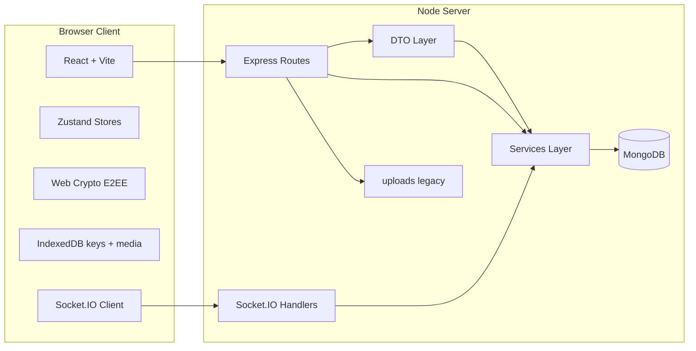
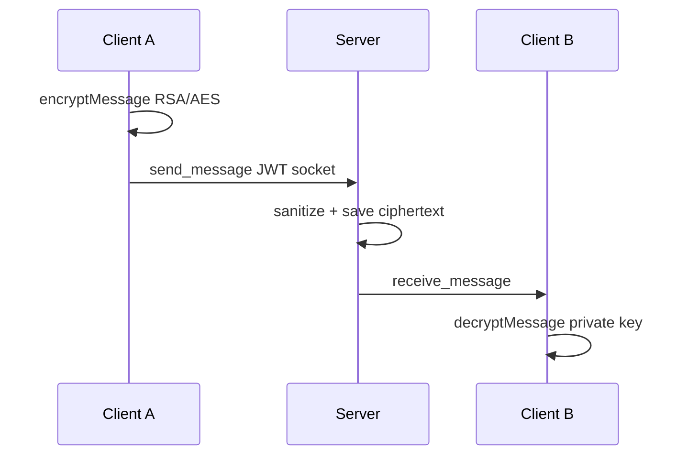
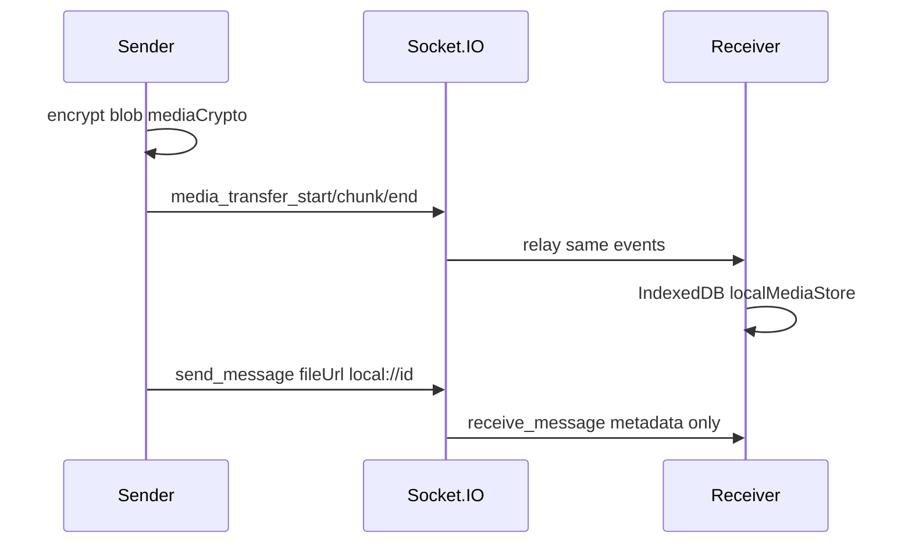
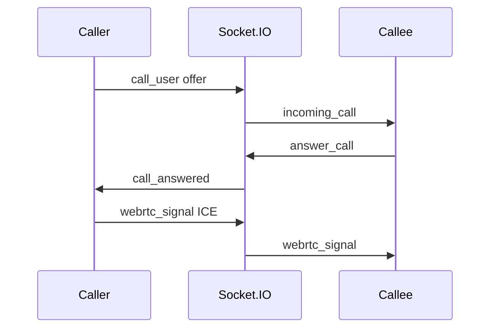

# Архитектура Hush

## Обзор

## Слои backend

| Путь | Назначение |
|------|------------|
| `server/server.js` | Bootstrap: helmet, CORS, health, webrtc config, routes |
| `server/routes/` | Тонкий HTTP-слой: валидация входа, вызов services, `next(err)` |
| `server/dto/` | Формирование ответов API (`userDto`, `messageDto`, `channelDto`) |
| `server/services/` | Бизнес-логика: `authService`, `chatService`, `channelService`, `userPrefsService`, `messageService`, `tokenService`, `configService` |
| `server/socket/handlers/` | Realtime: presence, messages, calls, mediaRelay |
| `server/middleware/` | JWT, rate limit, channel ACL, errorHandler |
| `server/models/` | Mongoose-схемы |
| `server/config/constants.js` | Лимиты, роли, STUN по умолчанию, префикс `local://` |
| `server/utils/` | logger, pagination, socketRoom, fileSecurity, SSRF, sanitize |

## Слои frontend

| Путь | Назначение |
|------|------------|
| `client/src/components/` | UI: Auth, Sidebar, ChatWindow, CallInterface, SettingsModal, баннеры |
| `client/src/stores/` | Zustand: `appStore`, `sidebarStore`, `chatWindowStore` |
| `client/src/utils/` | crypto, apiClient, local media (IndexedDB + socket relay), webrtcCall |

## Поток текстового сообщения (личный чат)

## Поток медиа (E2E, без диска сервера)

Подробности: [LOCAL_MEDIA.md](LOCAL_MEDIA.md).

## Поток звонка

## Масштабирование (не реализовано)

- Redis adapter для Socket.IO при нескольких инстансах
- Очередь jobs (Bull/Redis) вместо `setInterval` для scheduled/expire
- TURN как отдельный сервис для WebRTC за symmetric NAT
